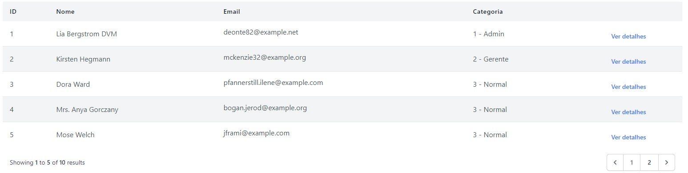
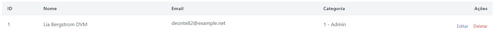
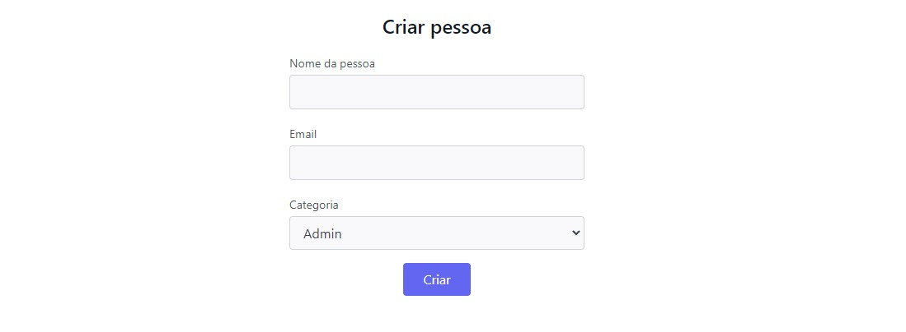
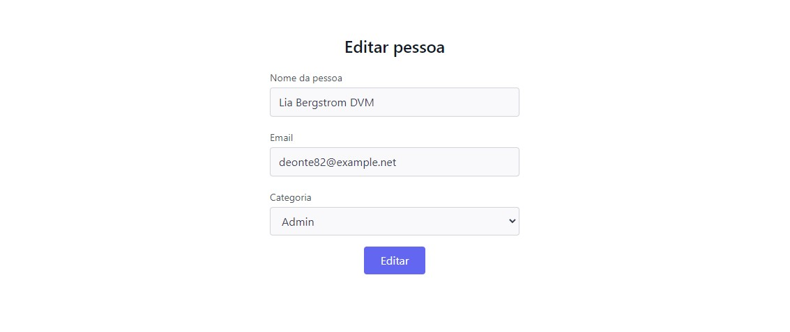
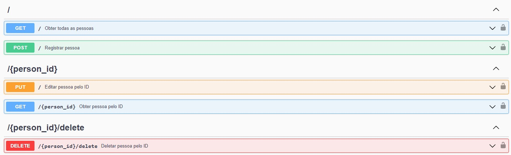

<p align="center"><a href="https://laravel.com" target="_blank"></a></p>
<h1 align="center">Teste Athenas Online </h1>

## Sobre o Projeto

O desafio é criar um crud simples em PHP e que salve os dados no banco de dados (Firebird, MySQL, Mongo, PostgreSQL etc) através de uma API REST.

## Tecnologias utilizadas
- PHP
- Laravel
- MySQL
- Docker
- Swagger


## Passos para rodar o Projeto

1. Clone o repositório utilizando este comando:

```terminal
$ git clone https://github.com/RafaelPereira7L/teste-athenas.git
```

2. Acesse a pasta do projeto no terminal:

```terminal
$ cd teste-athenas
```

3. Rode o comando para instalar todas as dependências com o Composer.

```terminal
$ composer install
```

4. Instalar o Laravel Sail para utilizar o Docker

```terminal
$ php artisan sail:install
```

5. Copie o .env.example para um novo arquivo chamado .env

```terminal
$ cp .env.example .env
```

6. Modifique as variáveis de ambiente da base de dados em .env:
    - **DB_DATABASE**: Nome da base de dados do projeto.
    - **DB_USERNAME**: Usuário do MySQL.
    - **DB_PASSWORD**: Senha do MySQL.

```dotenv
DB_DATABASE=athenas_crud
DB_USERNAME=athenas
DB_PASSWORD=root
```

7. Rodar a aplicação

```terminal
$ ./vendor/bin/sail up -d
```

7. Rodar migrations e seeders

```terminal
$ ./vendor/bin/sail artisan migrate --seed
```

<hr>
<br>

## Rotas da aplicação com Front End

- Obter todas as pessoas => http://localhost/


<br>
<br>

- Obter pessoa pelo ID => http://localhost/{person_id}


<br>
<br>

- Criar pessoa => http://localhost/create


<br>
<br>

- Editar pessoa => http://localhost/{person_id}/edit


<br>
<br>

- Deletar pessoa => http://localhost/{person_id}/delete

<hr>

## Rotas da API

 - SWAGGER

Visualizar Documentação via Swagger => http://localhost/api/doc
### Overview


<hr>

- ROTAS

    - GET
        - Obter todas as pessoas => http://localhost/
        - Obter pessoa pelo ID => http://localhost/{person_id}

    - POST
        - Criar pessoa => http://localhost/
    
    - PUT
        - Editar pessoa => http://localhost/{person_id}

    - DELETE
        - Deletar pessoa => http://localhost/{person_id}/delete


## License

The Laravel framework is open-sourced software licensed under the [MIT license](https://opensource.org/licenses/MIT).
